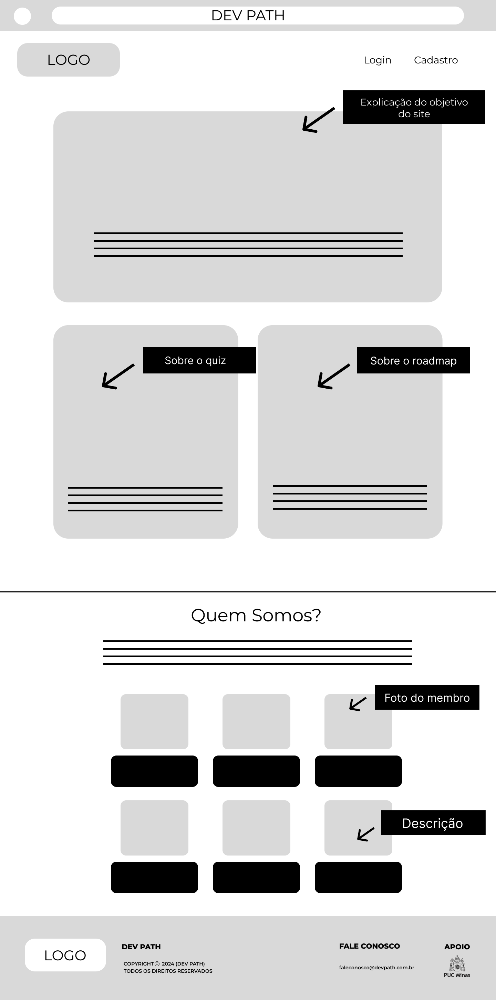
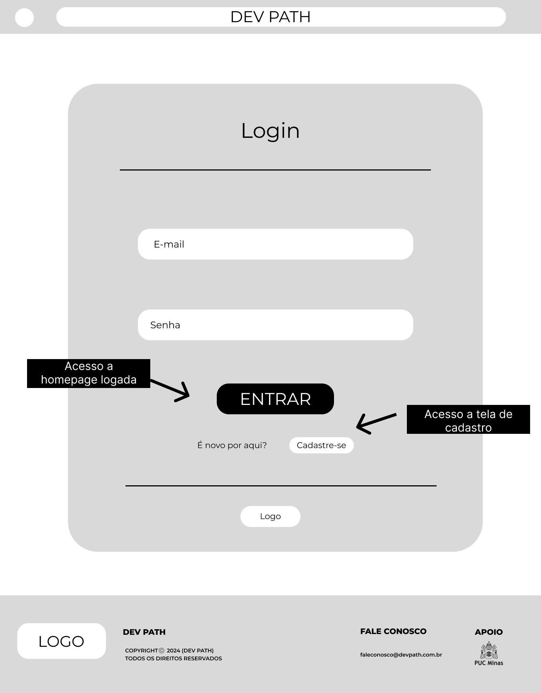
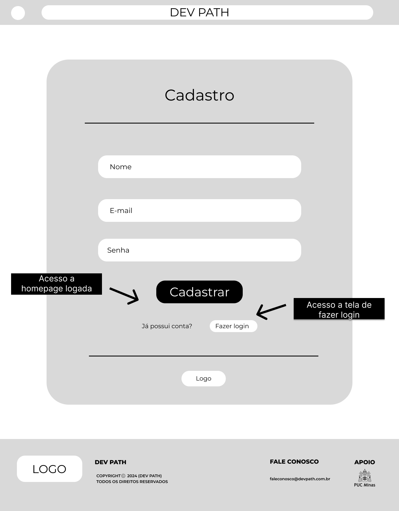
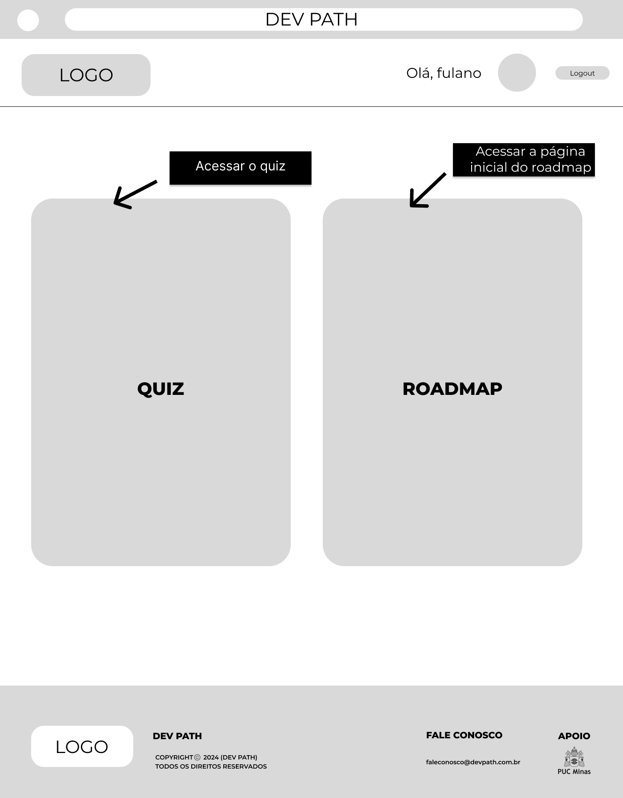
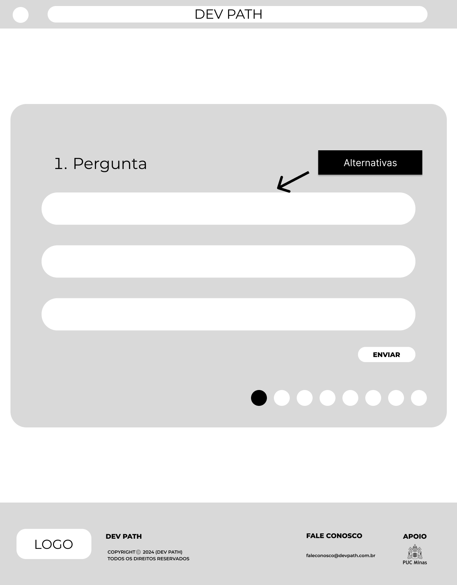
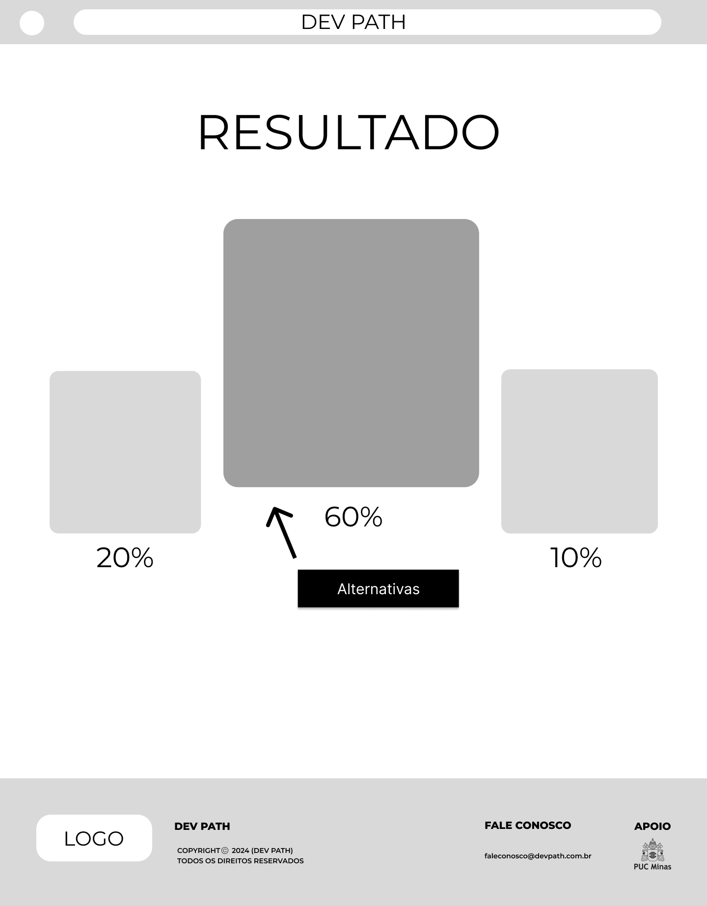
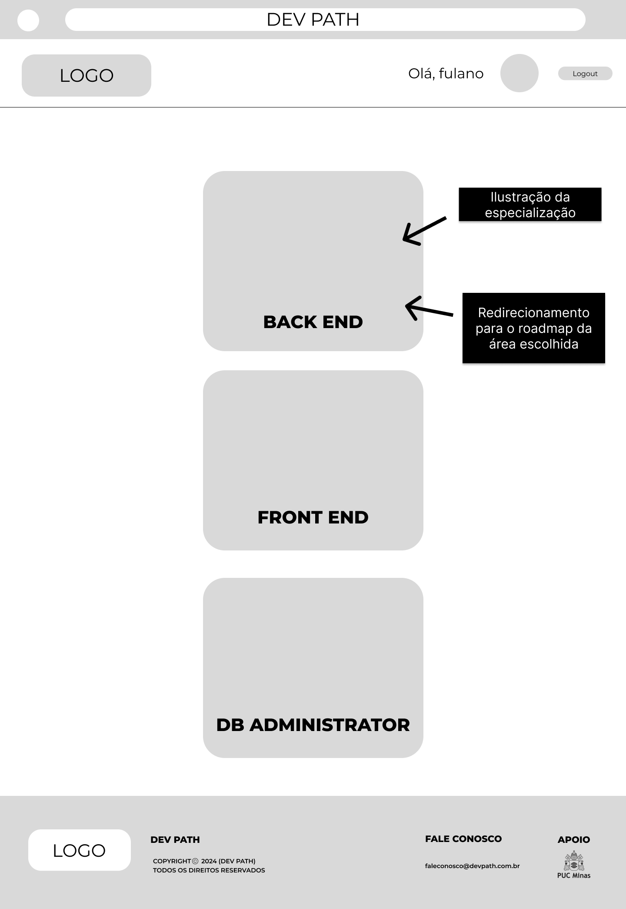
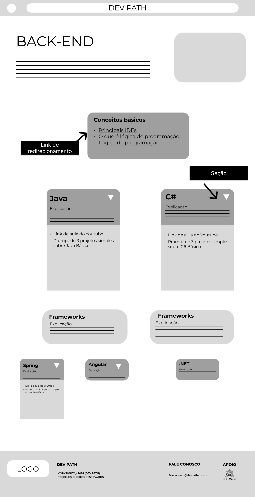

# Projeto de Interface

O Projeto de Inteface se divide em 8 páginas: Tela Inicial, Login, Cadastro, HomePage Logada, Quiz, Resultado do Quiz, Roadmap Inicial e Roadmap Área Escolhida. As páginas foram desenvolvidas para a facilitação de usuários que tem convívio com interações web, em todas as páginas há uma leitura clara e com caminhos objetivos que direcionam à aplicação requisitada.

## User Flow

## Tela Inicial

## Login

## Cadastro

## HomePage Logada

## Quiz

## Resultado Quiz

## RoadMap Inicial

## Roadmap Área Escolhida

